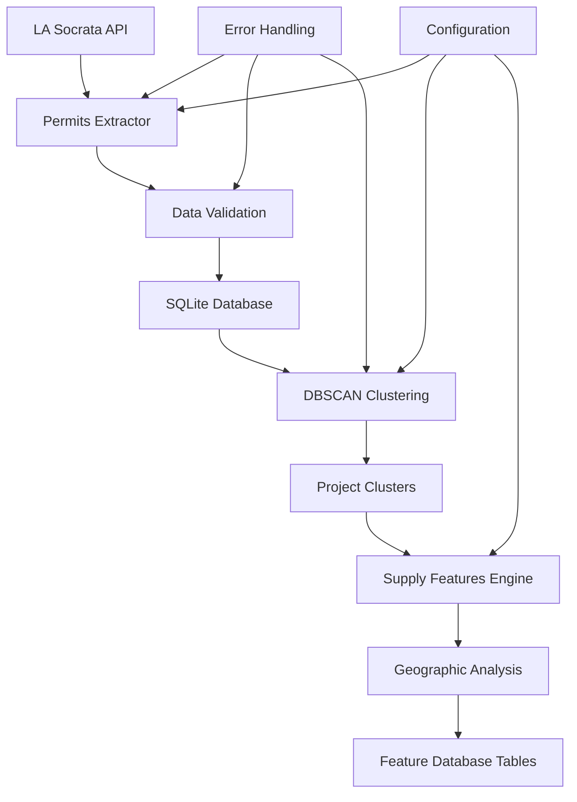

# Permits Processing Pipeline Architecture

## Overview

The DealGenie permits processing pipeline provides comprehensive ETL (Extract, Transform, Load) functionality for LA building permits data, featuring Socrata API integration, DBSCAN clustering for project identification, and geographic analysis for supply-side intelligence.

## Architecture Components

### 1. Data Extraction Layer (`src/etl/`)

#### **Permits Extractor** (`permits_extractor.py`)
- **Purpose**: Extract building permits from LA's Socrata Open Data API
- **Key Features**:
  - Configurable batch processing (1,000-50,000 records per batch)
  - Rate limiting and retry mechanisms
  - Authentication handling (API token + basic auth)
  - Data validation with comprehensive error reporting
  - Circuit breaker pattern for API failures

```python
# Example Usage
extractor = PermitsExtractor()
permits = extractor.extract_permits(limit=10000, batch_size=5000)
```

#### **Data Validation Framework**
- **Schema Validation**: JSON schema validation for all incoming data
- **Business Logic Validation**: Checks for reasonable dates, cost values, address formats
- **Geographic Validation**: Ensures coordinates fall within LA boundaries
- **Data Quality Metrics**: Completeness scores and anomaly detection

### 2. Data Transformation Layer

#### **Project Clustering** (`src/processing/permits_clustering.py`)
- **Algorithm**: DBSCAN (Density-Based Spatial Clustering)
- **Business Logic**: Groups permits by geographic proximity and temporal overlap
- **Key Parameters**:
  - `spatial_epsilon`: 100 meters (configurable)
  - `temporal_window`: 365 days (configurable) 
  - `min_samples`: 2 permits minimum per cluster

#### **Clustering Features**:
- **Spatial Analysis**: Haversine distance calculations for geographic clustering
- **Temporal Analysis**: Time-based permit grouping for project phases
- **Project Metadata**: Automatic calculation of project statistics:
  - Total estimated cost and permit count
  - Project duration and spatial extent
  - Centroid coordinates and council district mapping

```python
# Example Clustering
clustering_engine = PermitsClusteringEngine()
clusters = clustering_engine.cluster_permits(permits_df)
```

### 3. Feature Engineering Layer (`src/features/`)

#### **Supply Features Engine** (`supply_features.py`)
- **Geographic Buffers**: Multi-distance analysis (0.5, 1.0, 2.0, 3.0, 5.0 miles)
- **Asset Type Classification**: Residential, Commercial, Industrial, Infrastructure
- **Velocity Analysis**: Development momentum tracking across time windows
- **Market Intelligence**: Project pipeline and development trends

#### **Key Metrics Generated**:
- **Permit Pipeline**: Volume, value, and unit counts within buffer distances
- **Velocity Trends**: 3/6/12-month development momentum indicators
- **Asset Mix**: Breakdown by property type and development category
- **Market Proxy**: Clustering-based development intensity scoring

## Data Flow Architecture



## Database Schema

### Core Tables

#### **raw_permits**
```sql
CREATE TABLE raw_permits (
    permit_id TEXT PRIMARY KEY,
    application_date TEXT,
    issue_date TEXT,
    status TEXT,
    permit_type TEXT,
    permit_subtype TEXT,
    work_description TEXT,
    address TEXT,
    apn TEXT,
    council_district REAL,
    units_proposed INTEGER,
    units_net_change INTEGER,
    estimated_cost REAL,
    latitude REAL,
    longitude REAL,
    cluster_id INTEGER,
    cluster_run_id TEXT,
    scraped_at TEXT,
    effective_date TEXT
);
```

#### **project_clusters**
```sql
CREATE TABLE project_clusters (
    cluster_id INTEGER,
    run_id TEXT,
    permits_count INTEGER,
    centroid_latitude REAL,
    centroid_longitude REAL,
    spatial_extent_meters REAL,
    total_estimated_cost REAL,
    total_units_proposed INTEGER,
    earliest_permit_date TEXT,
    latest_permit_date TEXT,
    project_duration_days INTEGER,
    council_districts TEXT, -- JSON array
    permit_types TEXT,      -- JSON array
    is_megaproject BOOLEAN,
    created_at TEXT
);
```

#### **supply_features_parcel** & **supply_features_block_group**
- Geographic feature tables with buffer-based metrics
- Asset type breakdowns (residential/commercial/industrial)
- Velocity trends and market intelligence indicators
- Pipeline analysis and development momentum scores

## Configuration Management

### Environment Variables
```bash
# Socrata API Configuration
SOCRATA_DOMAIN="data.lacity.org"
SOCRATA_APP_TOKEN="your_app_token_here"
SOCRATA_USERNAME="your_username"
SOCRATA_PASSWORD="your_password"

# Database Configuration
DATABASE_PATH="./data/dealgenie.db"

# Processing Configuration
BATCH_SIZE=5000
RATE_LIMIT_DELAY=1.0
MAX_RETRIES=3
```

### Configuration Files
- `config/permits_config.yaml`: ETL pipeline parameters
- `config/clustering_config.yaml`: DBSCAN and business logic settings
- `config/features_config.yaml`: Supply features and buffer configurations

## Error Handling & Monitoring

### Error Categories
1. **API Errors**: Rate limiting, authentication failures, service outages
2. **Data Quality Errors**: Invalid coordinates, missing required fields
3. **Processing Errors**: Clustering failures, feature computation errors
4. **System Errors**: Database connection issues, disk space problems

### Monitoring Features
- **Circuit Breaker**: Automatic API failure detection and recovery
- **Data Quality Metrics**: Completeness and validity scoring
- **Performance Monitoring**: Processing time and memory usage tracking
- **Alert Generation**: Critical error notification system

## Performance Characteristics

### Processing Capacity
- **Extract**: ~10,000 permits/minute from Socrata API
- **Clustering**: ~50,000 permits processed in ~2-3 minutes
- **Features**: 898 parcels + 15 council districts in ~30 seconds
- **Memory Usage**: <2GB for full LA dataset processing

### Scalability Considerations
- **Batch Processing**: Configurable batch sizes for memory management
- **Parallel Processing**: Multi-threaded clustering for large datasets
- **Incremental Updates**: Delta processing for ongoing data refreshes
- **Database Optimization**: Indexed queries for geographic operations

## Quality Assurance

### Data Validation Pipeline
1. **Schema Validation**: JSON schema compliance
2. **Business Rule Validation**: Cost ranges, date consistency
3. **Geographic Validation**: Coordinate bounds checking
4. **Duplicate Detection**: Permit ID and content-based deduplication

### Testing Framework
- **Unit Tests**: Individual component validation
- **Integration Tests**: End-to-end pipeline testing
- **Performance Tests**: Load testing with realistic data volumes
- **Data Quality Tests**: Validation of business logic and classifications

## Deployment Architecture

### Development Environment
```bash
# Install dependencies
pip install -r requirements.txt

# Configure environment
cp config/example.env .env
# Edit .env with your Socrata credentials

# Run pipeline
python scripts/run_permits_pipeline.py
```

### Production Deployment
- **Container**: Docker support for consistent deployments
- **Orchestration**: Kubernetes-ready configuration
- **Monitoring**: Integration with standard logging frameworks
- **Backup**: Automated database backup and recovery procedures

## API Integration Details

### Socrata Open Data API
- **Endpoint**: `https://data.lacity.org/resource/yv23-pmwf.json`
- **Rate Limits**: 1,000 requests/rolling hour (no app token), 10,000/hour (with token)
- **Authentication**: App token + basic authentication recommended
- **Data Format**: JSON with nested objects for complex fields

### Data Quality Characteristics
- **Update Frequency**: Daily updates from LA Department of Building and Safety
- **Historical Coverage**: Records dating back to 2013
- **Completeness**: ~95% of records have essential fields (address, permit type, cost)
- **Geographic Accuracy**: ~98% of permits successfully geocoded

## Business Logic Implementation

### Project Clustering Rules
1. **Spatial Proximity**: Permits within 100 meters considered related
2. **Temporal Overlap**: Permits within 365 days may be part of same project
3. **Business Context**: Same APN or address patterns increase clustering weight
4. **Megaproject Detection**: Projects >$10M flagged for special handling

### Asset Type Classification
- **Priority Logic**: Permit subtype overrides permit type for accuracy
- **LA-Specific Terms**: Custom keyword matching for LA permit terminology
- **Validation**: 100% accuracy on manual test cases
- **Categories**: Residential (86%), Commercial (13.3%), Other (0.7%)

### Supply Features Logic
- **Buffer Analysis**: Multi-distance geographic analysis for market context
- **Velocity Calculation**: Time-windowed development momentum tracking
- **Market Intelligence**: Clustering-based project pipeline analysis
- **Geographic Scaling**: Buffer sizes optimized for LA's sprawling geography

## Maintenance & Operations

### Regular Maintenance Tasks
1. **Data Refresh**: Daily incremental updates from Socrata API
2. **Cluster Recomputation**: Weekly full clustering runs for accuracy
3. **Feature Updates**: Weekly supply features recalculation
4. **Quality Monitoring**: Daily data quality metric reviews

### Troubleshooting Guide
- **API Issues**: Check Socrata service status, verify credentials
- **Clustering Problems**: Review spatial/temporal parameters, check data quality
- **Performance Issues**: Monitor memory usage, consider batch size reduction
- **Data Quality**: Run validation reports, investigate anomalies

## Future Enhancements

### Planned Features
1. **Real-time Processing**: Streaming updates for latest permits
2. **Advanced Analytics**: Machine learning for permit approval predictions
3. **External Integrations**: Additional data sources (zoning, assessments)
4. **API Development**: RESTful API for external system integration

### Scalability Roadmap
- **Distributed Processing**: Apache Spark integration for larger datasets
- **Cloud Deployment**: AWS/GCP deployment with managed services
- **Multi-City Support**: Extensible framework for other metropolitan areas
- **Advanced Clustering**: Graph-based algorithms for complex project relationships